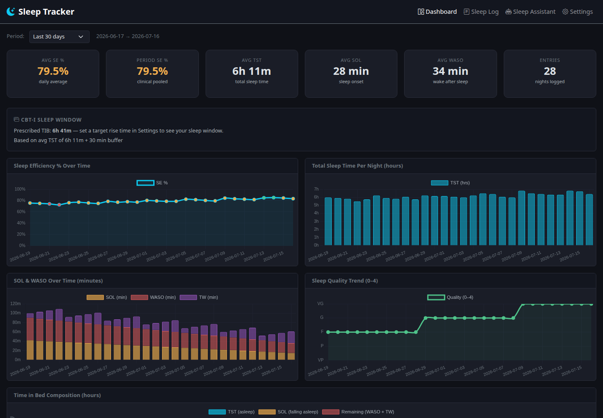

# Sleep Tracker

[](https://github.com/ga-142/sleep-tracker/actions/workflows/ci.yml)


A private, self-hosted sleep diary that turns nightly entries into useful
CBT-I-style metrics and trends. It combines deterministic calculations,
date-filtered reports, and an optional AI assistant that can explain the data
in plain language.



## Why this project

Most sleep apps hide calculations behind a subscription or send personal data
to a hosted service. Sleep Tracker keeps its SQLite database on your machine,
shows how every metric is calculated, and lets you choose whether AI analysis
runs through Anthropic or a local Ollama model.

## Highlights

- Interactive dashboard with efficiency, duration, latency, wakefulness, and
  quality trends
- Daily sleep diary with live calculated time in bed, total sleep time, and
  sleep efficiency
- Last week, last two weeks, last month, all-time, and custom date filtering
- CSV and readable text exports for exactly the selected date range
- Optional email delivery through Gmail SMTP
- Optional conversational analysis through Anthropic or fully local Ollama
- Seeded fictional demo data, regression tests, container health checks, and
  GitHub Actions CI

Period sleep efficiency uses the pooled calculation
`sum(total sleep time) / sum(time in bed) * 100`, rather than averaging nightly
percentages.

## Run it

Requirements: Docker with the Compose plugin.

```bash
git clone https://github.com/ga-142/sleep-tracker.git
cd sleep-tracker
docker compose up --build
```

Open <http://localhost:8081>. No API key or `.env` file is needed for the core
diary, dashboard, or exports.

To populate a new installation with the same fictional data shown above:

```bash
docker compose exec backend python seed_demo.py
```

The seeder refuses to modify a non-empty diary unless explicitly run with
`--force`.

## Optional AI assistant

The assistant is disabled until configured in **Settings**.

- **Local:** start Ollama with
  `docker compose --profile ollama up -d`, then select a local model.
- **Anthropic:** copy `.env.example` to `.env`, add an API key, and select
  Anthropic in Settings.

Anthropic requests include the sleep entries and profile context needed to
answer the question. Ollama keeps inference local. Stored secrets are masked
by the settings API and `.env` and database files are excluded from Git.

## Architecture

```text
Browser
  |-- static UI --> Nginx container
  `-- /api/* ----> Flask container ----> SQLite volume
                         |-- optional --> Anthropic API
                         `-- optional --> Ollama container
```

The UI is vanilla JavaScript with Bootstrap and Chart.js. Flask runs behind
Gunicorn and owns
validation, calculations, exports, email, and AI-provider integration. See
[the architecture notes](docs/ARCHITECTURE.md) for the data flow and design
decisions.

## Development

For backend tests and frontend syntax checks, install Python 3.12 and Node.js,
then create a virtual environment:

```bash
python3 -m venv .venv
.venv/bin/pip install -r backend/requirements.txt
```

Run the same checks used in CI:

```bash
./scripts/check.sh
```

The suite covers metric calculations, inclusive date filtering, export
validation and labels, secret masking, and API health. Contributions are
welcome; read [CONTRIBUTING.md](CONTRIBUTING.md) first.

## Data and safety

Diary data persists in the Docker volume `sleep_data`; `docker compose down`
keeps it, while `docker compose down -v` deletes it. The application has no
authentication and is designed for local use—do not expose port 8081 directly
to the public internet.

Sleep Tracker is an educational self-tracking project, not a medical device.
It does not diagnose or treat insomnia. If sleep problems are severe,
persistent, or raise safety concerns, consult a qualified clinician.

[Security policy](SECURITY.md) · [MIT license](LICENSE)
